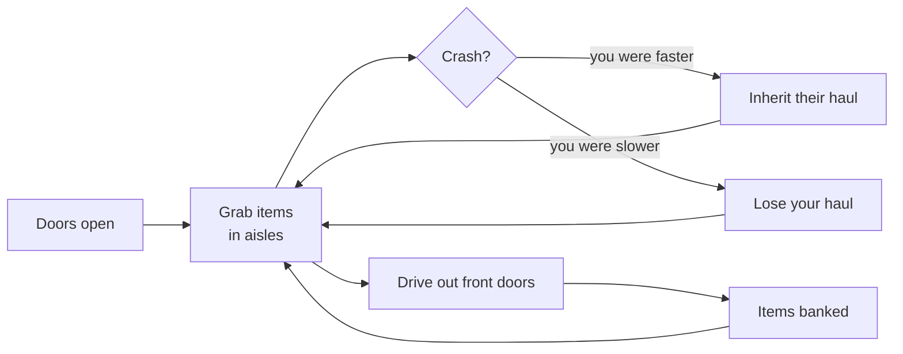
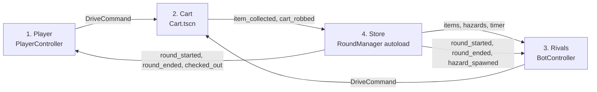

# Checkout Chaos: Game Spec

**Version:** 1.0 · **Date:** 2026-09-23 · **Team:** Rickey (Player), Evan (Cart), John (Rivals), Anthony (Store / Round Manager)

This is the master spec for the game and the source of truth for every agent and teammate. It merges the two design documents in [`reference/`](reference/):

- **Team GDD** (`Checkout Chaos - Four System Team GDD.pdf`, the submitted version). **This one wins when the two disagree.**
- **Rickey's GDD** (`Checkout Chaos — Game Design Doc.pdf`, the earlier and more detailed draft). It supplies detail the team GDD leaves out.

How each conflict was resolved is recorded in [`DECISIONS.md`](DECISIONS.md). The exact code interfaces between systems are in [`CONTRACTS.md`](CONTRACTS.md). If this file and `CONTRACTS.md` disagree about a signature, `CONTRACTS.md` wins. If they disagree about a gameplay rule or number, this file wins.

---

## 1. Overview

Checkout Chaos is a 3D shopping-cart racer. One human and three bot shoppers race through a grocery store's grand-opening sale. They grab items, ram each other to inherit hauls, and drive out the front doors to check out.

| | |
|---|---|
| Engine | Godot 4.7.2, 3D, GDScript (see [`TECH_STACK.md`](TECH_STACK.md)) |
| Target | Web (HTML5) export; desktop runs for development |
| Camera | Third-person chase cam behind the cart |
| Players | 1 human vs 3 bots |
| Match | Best of 3 rounds, 2:00 each |
| Art | Low-poly, bright flat colors, no textures except signage |
| Team | 4 people, one system each |
| Prototype | Earlier browser version built in Three.js (reference for feel and tuning) |

**Win condition:** win the most rounds (stamps). A round is won by checking out the most money. Items still in your cart when a round ends don't count.

### Milestones

| Milestone | Date | Must include |
|---|---|---|
| **Demo** | Fri 2026-09-25 | One full round: drivable cart + chase cam, item spawns in 6 aisles, 24-item cap + weight slowdown, checkout banking, 2:00 timer, 3 simple bots that grab, bank and ram, ram-steal with spills, plain HUD |
| **Final** | Fri 2026-10-02 (code freeze Thu 10-01 night) | Everything in [§10 Scope → Final](#10-scope) |

---

## 2. Story: Grandma's Card

Your grandma was the store's most famous shopper, a legend of past sales. She leaves you her **Platinum Shopper ID card** and one instruction: *"Don't let Carl win."* The rival shoppers are her old rivals and their grandkids.

- **Round framing:** each round is one day of the sale weekend. Winning a round adds a stamp to Grandma's card.
- **Ending:** win the match and the card is reissued in your name.
- **Store name:** open decision (see `DECISIONS.md`). Until it's decided, use **Bumper Crop Market**, the prototype's name. Keep the name in one constant or string so renaming is a one-line change.

### 2.1 The Shopper ID card

The card is both a story prop and UI. It appears on the **title**, **character-select**, and **results** screens.

- **Front:** store logo, name, photo, member number, "Member since" year, tier badge (Bronze / Silver / Gold / Platinum)
- **Back:** barcode, lifetime savings, and a stamp row that fills with one stamp per round won
- Each bot has its own card, which doubles as its intro and personality blurb.

### 2.2 The rivals

| Shopper | Card tier | Style | Personality |
|---|---|---|---|
| Coupon Carl | Gold | Rammer | Clips every coupon, and he'll run you over for a deal |
| Aunt Bev | Platinum | Safe banker | Has shopped here since opening day and checks out early and often |
| Rolling Rita | Silver | Speed demon | Boosts everywhere and holds out for a giant haul |

### 2.3 Wording guide (keeps the inheritance theme visible)

A rammed cart's haul is **inherited**, not stolen. All in-game text uses this framing:

- Event feed: "Rita inherited Carl's cart" (not "Rita stole from Carl")
- Popups: "Inherited! +7 items", "Checked out $180"
- A rammed shopper is "knocked out of the sale" and their haul is "left to" the winner.

---

## 3. Core loop and match rules

The core loop is **grab, protect, check out**, repeated as many times as you dare in 2 minutes.



Every trip back into the store is a risk-and-reward choice. A fuller cart is worth more, but it's slower, so it's easier to catch and inherit from.

### 3.1 One round (2:00)

| Phase | When | What happens |
|---|---|---|
| `COUNTDOWN` | 3 s before the timer starts | Carts line up outside the front doors. Controls are locked. Doors slide open on GO. |
| `RUSH` | 2:00 → 0:21 | Grab items, avoid or hunt rivals, check out. Hazards appear (Final milestone). |
| `FINAL_CALL` | Last 20 s (0:20 → 0:00) | The PA announces closing, the timer turns red, and the muzak speeds up. Gameplay continues. |
| `CLOSED` | Timer hits 0:00 | Doors shut. Controls lock. Pending steals and checkouts that were already accepted finish; then no new pickups, steals, or checkouts are accepted. Items still in carts are lost. |
| `RESULTS` | 10 s | Round receipt: each shopper's banked total for the round, the stamp awarded, and the standings. |

### 3.2 Best of 3

- **Round score:** money checked out during that round.
- **Round winner:** the highest round score gets a stamp on their Shopper ID card. If two or more shoppers tie for highest, each gets a stamp. If nobody banked anything, no stamp is awarded. *(Tie handling is proposed; the Store owner confirms it in `DECISIONS.md`.)*
- **Match winner:** the most stamps. On a stamp tie, the highest total banked across all three rounds wins. An exact remaining tie is shared.
- **Between rounds:** the 10 s results screen, then carts reset **empty** at their start positions and the next countdown begins.
- **Difficulty per round:** hazards become more frequent and bot aggression rises. **The timer stays at 2:00 every round.**
- **After round 3:** `MATCH_OVER`. Show the match results (receipt style, Shopper ID card with stamps, standings). If the human wins, the card is reissued in their name.

---

## 4. The four systems

The game is built as four systems, one per teammate. None of them works alone, and each one's output is another's input.

| # | System | Owner | Owns (state) | Depends on | Code lives in |
|---|---|---|---|---|---|
| 1 | **Player** | Rickey | Human input, camera, HUD, Shopper ID screens, feedback (popups, sound, rumble) | Cart (to drive), Store (round state) | `systems/player/` |
| 2 | **Cart** | Evan | Position, velocity, speed; boost meter; `items[]` and value; stun and immunity timers | A driver (Player or Rivals), Store (items, checkout zone) | `systems/cart/` |
| 3 | **Rivals** | John | Bot targets, paths, decision timers, greed, aggression, boost habit, unsticking state | Cart (to drive), Store (items, exit, timer) | `systems/rivals/` |
| 4 | **Store / Round Manager** | Anthony | Round phase and timer; doors; world pickups and spawns; hazards; banked scores, stamps, standings | Cart (who holds what), all drivers (start/stop) | `systems/store/`, `systems/core/` |

**One writer per piece of state.** Player reads gameplay state only to display it. Rivals reads it only to make decisions. Store asks Cart to change inventory and never edits `items[]` directly. Cart reports completed transfers to Store.



**The key contract:** Player and Rivals both produce the same `DriveCommand`, and Cart doesn't know or care which one is driving. Full signatures are in [`CONTRACTS.md`](CONTRACTS.md).

### 4.1 Player (Rickey)

Turns what the human presses into driving commands, and presents the game (HUD, screens, feel).

- **Controls → `DriveCommand`** every physics frame (see [§8](#8-controls-and-camera)).
- **Chase camera:** about 8.5 m behind and 5.5 m above the cart, looking slightly ahead. FOV widens from 62° to 72° while boosting. Brief shake when rammed.
- **HUD:** see [§9.2](#92-hud).
- **Feedback:** popups ("Inherited! +7 items", "Checked out $180"), sounds, controller rumble.
- **Screens:** title, character select, story intro, results receipt, match results, all built around the Shopper ID card. Pause menu.
- **Audio:** music, PA announcer, and sound effects (see [§9.3](#93-audio)). Player owns playback. Store and Cart emit the events that trigger sounds.
- **Output:** a `DriveCommand` sent to its Cart every physics frame; UI and audio.

### 4.2 Cart (Evan)

The physical cart and everything it carries. Players and bots use the **same** `Cart.tscn`.

- **Movement:** arcade handling, top speed about **15 m/s**. Throttle, brake/reverse, steer.
- **Weight:** each carried item lowers top speed by **1.2%**, so a full cart (24 items) is about **29% slower**.
- **Boost meter:** +**8 m/s** top speed while held. A full meter drains in about **2 s** and refills in about **8 s** while not boosting.
- **Inventory:** up to **24** items, shown stacked in the basket, with total value tracked.
- **Crash rule:** the ram-steal rule in [§5](#5-inheritance-ram-steal-and-spills). The loser is stunned for **0.7 s** and immune for **1.6 s**.
- **Hazard response (Final):** wet floor disables steering for 1 s and the cart slides.
- **Visual identity:** colored rim, handle and flag, plus a floating name tag. The player is **yellow**.
- **Signals out:** `item_collected`, `cart_robbed`, `cart_full`.

Movement formula (Evan may refine it in the `cart/01-movement` spec, but the result must match the numbers above):

```
top_speed = (BASE_TOP_SPEED + (BOOST_BONUS if boosting else 0.0)) * (1.0 - SLOWDOWN_PER_ITEM * item_count)
```

Physics approach (arcade `RigidBody3D` or kinematic `CharacterBody3D`) is Evan's call in the movement spec, recorded in `DECISIONS.md`. **Fallback if physics carts jitter:** kinematic carts with our own speed rule, like the prototype.

### 4.3 Rivals (John)

Three AI shoppers that drive the same Cart through the same `DriveCommand` a player uses.

- **Decisions every 0.3 s:** pick the pickup with the best **value ÷ distance**; or chase a rival carrying a big load; or head for checkout when greedy enough or when time is short.
- **Pathing:** `NavigationAgent3D` on a baked navmesh of the store. **Fallback:** hand-placed waypoints at the aisle ends, like the prototype.
- **Personalities:** greed (items before banking), aggression (how often it rams), boost habit. Values come from the rivals table ([§2.2](#22-the-rivals)) and the tuning table ([§12](#12-tuning-table)).
- **Unsticking:** if the bot barely moves for 1 s, it reverses and turns.
- **Difficulty:** aggression rises each round.
- **Reactions (Final):** retarget on `cart_robbed`; reroute on `hazard_spawned`.

### 4.4 Store / Round Manager (Anthony)

The referee and the world. It owns everything the carts compete over. Anthony is also the **integration owner**: `Main.tscn`, `project.godot` (input map, autoloads), and `export_presets.cfg`.

- **Round flow:** countdown → door animation → timer → final call → close → results → next round → match end ([§3](#3-core-loop-and-match-rules)).
- **Store level:** 6 aisles, front doors, checkout zone past the doors, 4 start positions outside, baked navmesh for the bots.
- **Item spawns:** [§6](#6-items-spawns-and-deal-of-the-day).
- **Deal of the Day (Final):** a gold $100 item every 14–22 s, with a light beam and a PA announcement.
- **Hazards (Final):** [§7](#7-hazards).
- **Checkout:** the zone past the front doors. It banks a cart's value and empties it through Cart's `take_all_items()`.
- **Spills:** spawns the `spilled` items from `cart_robbed` as normal pickups around the crash.
- **Scoring:** round receipts, stamps, match standings.

---

## 5. Inheritance: ram-steal and spills

Inheritance is the main way wealth moves in the game. When two carts crash, the faster cart inherits the slower cart's entire haul. Whatever doesn't fit spills onto the floor for anyone to inherit.

### 5.1 Rule 1: ram-steal

1. Two carts touch.
2. Compare their speeds **at the moment of contact** (before the collision response changes them). The faster cart wins only if it is moving **at least 5 m/s** and is **at least 1.5 m/s faster** than the other.
3. The slower cart loses **all** its items. They fly across into the faster cart, up to the 24-item cap.
4. The slower cart is knocked back, **stunned for 0.7 s** (driving input ignored) and **immune for 1.6 s** (cannot lose items again, so it can't be chain-robbed).
5. If the speeds are too close, both carts bounce off and nothing changes hands.
6. Each contact resolves **exactly once**, even though both carts detect it (see the invariants in `CONTRACTS.md`).

### 5.2 Rule 2: spilled items

- If the winner can't hold everything, the overflow spills on the floor around the crash.
- Spilled items become normal pickups that anyone can grab, including the cart that just lost them.
- A spilled Deal of the Day stays gold and keeps its $100 value.
- Which items fit and which spill must be **deterministic**. Recommended: transfer in the loser's collection order (oldest first) until the winner is full; the rest spill. Evan confirms it in the `cart/03-ram-steal` spec.

### 5.3 Worked example (value is conserved)

Rita (20 items, $260, boosting at 14 m/s) rams you (8 items, $110, 6 m/s). 14 ≥ 5 and 14 − 6 = 8 ≥ 1.5, so Rita wins.

| | Rita before | You before | Rita after | You after | Floor after |
|---|---|---|---|---|---|
| Items | 20 ($260) | 8 ($110) | 24 ($310) | 0 | 4 items ($60) |

Four of your items fit (worth $50) and four spill (worth $60). Total value stays $370. You're stunned for 0.7 s, then you can grab back the 4 spilled items before Rita turns around.

### 5.4 Why it matters

- **Parking is dangerous.** A stopped cart has speed 0, so any cart moving 5 m/s or faster can take everything.
- **Weight is a trade-off.** A full cart is slower, which makes it easier to catch.
- **Comebacks.** The last-place shopper can take the leader's full cart with one well-timed hit.
- **The story matches.** You inherit Grandma's card and her rivals; in play you inherit other carts' hauls.

### 5.5 Edge cases each owner resolves in their feature spec

| Case | Owner | Default until decided |
|---|---|---|
| Faster cart hits an empty cart | Evan | Treat as a bounce: no transfer, no stun, no `cart_robbed` |
| Winner is already full (24) | Evan | Everything from the loser spills |
| Two contacts in the same physics frame | Evan | Resolve one pair at a time; immunity blocks the second |
| Steal and checkout in the same frame | Evan + Anthony | Steal resolves first, then checkout ([`CONTRACTS.md`](CONTRACTS.md) invariant 3) |
| Contact after `CLOSED` | Evan + Anthony | Ignored ([`CONTRACTS.md`](CONTRACTS.md) invariant 4) |
| Stunned cart drives over a pickup | Evan | Pickup is still collected (stun blocks driving, not collecting) |

---

## 6. Items, spawns, and Deal of the Day

Each aisle has its own color so players read value by color. Colors pair with aisle signs, item shapes and displayed values.

| Aisle | Category | Value each | Spawn weight | Color |
|---|---|---|---|---|
| 1 | Produce | $5 | High | Green |
| 2 | Bakery | $10 | High | Orange |
| 3 | Dairy | $10 | High | White |
| 4 | Snacks | $15 | Medium | Red |
| 5 | Frozen | $20 | Low | Blue |
| 6 | Electronics | $40 | Rare | Purple |
| Any | Deal of the Day | $100 | 1 at a time, every 14–22 s | Gold + light beam |

- **Floor cap:** up to **46** regular items on the floor. A new regular item spawns every **0.5 s** while under the cap, in its category's aisle.
- **Spills ignore the cap.** They always spawn, and regular spawning pauses until the floor count drops below 46 again.
- **Deal of the Day** (Final) is separate from the cap. Only one is on the floor at a time; it spawns every 14–22 s (random) after the previous one is collected or spilled, with a PA announcement.
- **Identity:** every spawned item gets a unique `item_id` for the whole match, so conservation can be tested by identity, not just count (see `CONTRACTS.md`).

---

## 7. Hazards

Three core hazards ship in the Final build. Frequency rises each round (exact schedule set in the `store` hazards spec).

| Hazard | What happens | Counterplay | Systems |
|---|---|---|---|
| Wet floor spill | Steering stops working for 1 s and the cart slides | A yellow sign warns you; steer around it | Store places it; Cart applies the slip |
| Employee with pallet jack | Crosses an aisle slowly, blocks it and bumps carts | Wait, or take another aisle | Store (moving obstacle); Rivals reroute |
| Falling display | A stack of cans wobbles for 1 s, then topples and blocks the tile for 5 s | Watch for the wobble | Store; Rivals reroute |

Cut from this build (in the Stretch backlog): sample lady, "Cleanup on aisle X" closures.

---

## 8. Controls and camera

| Action | Keyboard | Gamepad | Input action name |
|---|---|---|---|
| Gas | W / Up | Right trigger | `drive_gas` |
| Brake / reverse | S / Down | Left trigger | `drive_brake` |
| Steer left | A / Left | Left stick left | `steer_left` |
| Steer right | D / Right | Left stick right | `steer_right` |
| Boost | Shift / Space | A (Xbox) / Cross (PS) | `boost` |
| Pause | Esc | Start | `pause` |

Input actions live in `project.godot` (integration owner). The names above are part of the contract.

**Camera:** chase cam about 8.5 m behind and 5.5 m above the cart, looking slightly ahead. FOV 62°, widening to 72° during boost. Brief shake on being rammed.

---

## 9. Art, HUD, and audio

### 9.1 Art direction

- Low-poly shapes, bright flat colors, no textures except signage.
- Checkered mint-and-cream linoleum floor, hanging aisle signs, and a red-and-yellow grand-opening banner outside.
- Each shopper's cart has a colored rim, handle and flag, plus a floating name tag. The player is yellow. Suggested bot colors: Carl teal, Bev pink, Rita silver. Rickey and Evan can change them.
- Animation and feedback: items fly between carts on a steal; doors animate open and shut; camera shakes on rams; falling displays wobble 1 s before collapsing.
- **Web performance:** the Deal of the Day "light beam" should be an emissive or unshaded mesh, not a real light. Keep dynamic lights to a minimum (Compatibility renderer).

### 9.2 HUD

| Position | Contents | Milestone |
|---|---|---|
| Top left | Timer and round number (timer red during `FINAL_CALL`) | Demo |
| Top right | Scoreboard: each shopper's banked total and current cart value | Demo |
| Bottom center | Cart panel: item count / 24, cart value, boost meter | Demo (count and value); Final (boost) |
| Under the timer | Store minimap | Final |
| Bottom left | Event feed of inheritances and checkouts | Final |
| Full screen | Results receipt with the Shopper ID card and stamps | Demo: plain results; Final: receipt |

### 9.3 Audio

- Upbeat supermarket muzak that speeds up in the final 20 s.
- PA announcer: doors opening, Deal of the Day, hazards, final call.
- Sound effects: item pickup blip, crash thud, steal whoosh, register ding on checkout, squeaky wheel loop.
- **Web:** browsers block audio until the first user input, so audio starts after the title screen's "press any key".

---

## 10. Scope

Stretch work only starts once the Final scope runs end to end.

### Demo (Fri 09-25)

| Feature | System |
|---|---|
| Drivable cart (throttle, brake/reverse, steer) with chase cam | Cart, Player |
| 24-item inventory, weight slowdown | Cart |
| Ram-steal and spilled items | Cart, Store |
| Greybox store: 6 color-coded aisles, doors, checkout zone, start positions, navmesh | Store |
| Item spawns (weights, 46 cap, 0.5 s) and checkout banking | Store |
| One round: countdown → rush → final call → close → plain results | Store |
| 3 bots: grab → bank → ram, with unsticking | Rivals |
| Plain HUD: timer, round, scoreboard, cart count and value | Player |

### Final (Fri 10-02)

| Feature | System |
|---|---|
| Boost meter (+8 m/s, 2 s drain, 8 s refill) with FOV widening | Cart, Player |
| Best of 3 rounds, stamps, tie rules, receipt results, match results | Store, Player |
| Deal of the Day | Store |
| Hazards: wet floor, pallet jack, falling display, per-round escalation | Store, Cart, Rivals |
| Bot personalities (Carl, Bev, Rita), aggression rising per round, retarget and reroute | Rivals |
| Shopper ID card screens, Grandma's Card story intro, bot intro cards | Player |
| Popups, camera shake, event feed, minimap, rumble, pause menu | Player |
| Audio: muzak, PA, sound effects | Player |
| Art pass: aisle colors, cart colors and flags, name tags, signage, banner | All (each in own system) |
| Web export tested through a local server | Store (integration) |

### Stretch (after Final runs end to end)

Sample lady; "Cleanup on aisle X" closures; cart types (heavy, fast, big basket); local split-screen (2 players + 2 bots); online multiplayer; round-winner card perk (for example, +2 cart slots in the next round).

**Multiplayer path (for the record):** a second human is just another source of `DriveCommand`s. Local split-screen means two `PlayerController`s with two cameras and viewports. Online means Godot's high-level multiplayer, where the host runs the Store and all collisions and clients send only their `DriveCommand`, which keeps steals fair.

---

## 11. Risks and the first integration check

### 11.1 Risks and fallbacks

| Risk | Fallback |
|---|---|
| Bot pathing through aisles | Hand-placed waypoints at the aisle ends, like the prototype |
| Collision feel (physics carts jitter) | Kinematic carts with our own speed rule, like the prototype |
| Merge conflicts in shared scenes | Only Anthony edits `Main.tscn`; everyone else instances their own scenes |
| **The `cart_robbed` seam breaks first** | See §11.2 |

### 11.2 Which seam breaks first, and how we test it

We predict the Cart → Store seam, `cart_robbed(winner, loser, items, spilled)`, breaks first. Cart decides who wins and transfers the haul, while Store creates the overflow pickups. A duplicate collision callback, a different reading of `items` versus `spilled`, or a checkout in the same update can duplicate items, lose value, or bank a haul twice.

**The first integration check.** It is an acceptance test for the Demo and must also be written as GUT tests:

1. Drive a 20-item cart into an 8-item cart at qualifying speeds. The winner must finish with 24 items, the loser with 0, and Store must create exactly 4 spilled pickups. **Check item identities (`item_id`) and total value, not just counts.**
2. Repeat the contact during immunity: no second transfer and no extra spills.
3. Run the same collision at the checkout boundary and at round close. Each item must reach exactly one destination, and checked-out value is recorded exactly once.
4. Include a $100 Deal of the Day in the spill (Final): its value and gold look must survive.

**If value is lost or duplicated:** log the collision, the transferred and spilled item IDs, and the checkout event, in order. Test Cart with a fake Store listener, then reconnect the real Store.

---

## 12. Tuning table

Every number in the game, in one place. The owner may tune a value; changing it means updating this table in the same PR. "Starting value" means a first guess to be tuned in playtesting.

| Constant | Value | Owner | Source |
|---|---|---|---|
| Cart base top speed | 15 m/s | Evan | GDD |
| Slowdown per item | 1.2% of top speed | Evan | GDD |
| Item cap | 24 | Evan | GDD |
| Boost bonus | +8 m/s top speed | Evan | GDD |
| Boost drain / refill | ~2 s full → empty / ~8 s empty → full | Evan | GDD |
| Steal minimum speed | 5 m/s | Evan | GDD |
| Steal speed margin | 1.5 m/s | Evan | GDD |
| Stun / immunity after loss | 0.7 s / 1.6 s | Evan | GDD |
| Wet-floor slip | 1 s no steering | Evan (effect), Anthony (placement) | GDD |
| Camera offset | 8.5 m behind, 5.5 m up | Rickey | GDD |
| Camera FOV normal / boost | 62° / 72° | Rickey | GDD |
| Round length | 2:00 every round | Anthony | Team GDD |
| Countdown / final call / results | 3 s / last 20 s / 10 s | Anthony | GDD |
| Rounds per match | 3 | Anthony | GDD |
| Floor item cap / spawn interval | 46 / 0.5 s | Anthony | GDD |
| Spawn weights (produce, bakery, dairy, snacks, frozen, electronics) | 30, 25, 25, 12, 6, 2 (percent) | Anthony | Starting value |
| Deal of the Day value / interval | $100 / 14–22 s | Anthony | GDD |
| Falling display warning / block | 1 s / 5 s | Anthony | GDD |
| Hazard frequency per round | Set in the hazards spec; rises each round | Anthony | Team GDD |
| Bot decision interval | 0.3 s | John | GDD |
| Bot stuck detection | barely moving for 1 s → reverse and turn | John | GDD |
| Carl: greed / aggression / boost habit | 12 items / 0.8 / 0.4 | John | Starting value |
| Bev: greed / aggression / boost habit | 6 items / 0.2 / 0.2 | John | Starting value |
| Rita: greed / aggression / boost habit | 20 items / 0.4 / 0.9 | John | Starting value |
| Bot aggression increase per round | +0.1 per round, capped at 1.0 | John | Starting value |

Aggression and boost habit run from 0 to 1 (probability or intensity, defined in the Rivals personality spec). Greed is the item count at which the bot heads for checkout.
