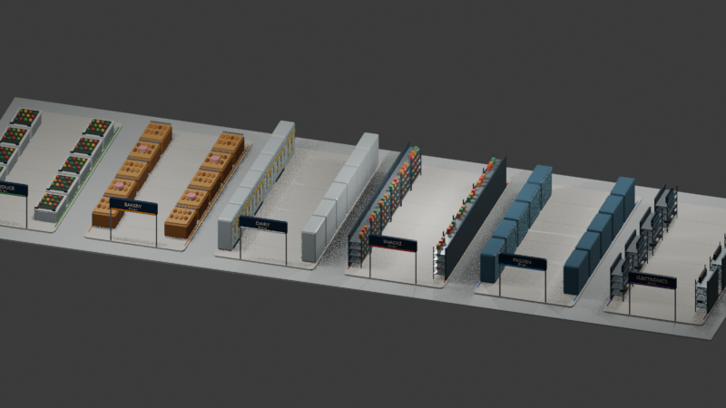

# Six stylized grocery aisles

- Owner: Evan (Assets)
- Branch: `assets/02-store-aisles`, based on current `main` (`0b1f5f2`)
- Status: six aisle sets and six shelf-matched item visuals are available in Godot; production pickup/cart integration and final visual review remain.

## Requested follow-up: shelf-matched pickup items

### Spec

- Replace the generic blocks used for the six category pickups and the colored
  blocks shown in the demo cart with recognizable product models that also
  appear on the corresponding aisle shelves: produce, bakery loaf, dairy
  carton, snack bag, frozen pizza, and game console.
- Deliver the models through the existing `ASSETS.md` paths:
  `assets/models/items/<category>_visual.tscn` for each of the six categories.
- Keep each scene a visual-only `Node3D` named `<Category>Visual`, with its
  origin at floor contact, approximately 0.2–0.5 m overall, and no script,
  collision, physics, or lights. Use the existing modeled shelf products and
  their materials so floor pickups match the aisles.
- In `assets/test/store_gameplay_aisles_preview.tscn`, swap only the demo test
  pickup's display mesh and cart stack's colored blocks for the corresponding
  category visual. Preserve pickup category, collision shape, respawn, and
  collection logic; leave each gameplay system's own scripts untouched.
- Do not edit `systems/cart/`, `systems/store/`, `systems/core/main.tscn`, or
  `project.godot`. The production pickup and cart-stack owners can instance
  the six scenes through the existing asset manifest.
- Verify all six variants on floor pickups and collected cart contents in the
  playable asset preview, and confirm pickups can still be collected.

### Plan

1. Export six compact, centered item models from the matching shelf products.
2. Add visual-only Godot wrapper scenes at the existing manifest paths.
3. Update the Evan-owned gameplay preview to use the matching scene for each
   demo category pickup.
4. Run the preview and verify visible variants, pickup collection, cart
   contents, and clean Godot logs; update the manifest and Evan handoff.

### Acceptance checklist

- [x] Six item scenes load and are visual-only with origins at floor contact.
- [x] Each category pickup and matching cart item in the playable asset
      preview uses its shelf product model instead of a block.
- [x] Pickup collection and respawn still work, and cart contents update after
      collection, checkout, and inheritance.

## Brainstorm

Evan requests six distinct product-filled supermarket aisles in the supplied
`Assets.blend`: produce, bakery, dairy, snacks, frozen foods, and electronics.
The store should feel like a modern big-box supermarket, with one cohesive
stylized art direction matching the project's cart and category palette.

## Spec

- Add the six aisle environments to the existing `Assets.blend` without
  replacing or deleting the existing scene content.
- Make each aisle recognizable from its fixtures and products:
  - **Produce:** open-front chilled cases with colorful fruit and vegetables in
    crates and bins.
  - **Bakery:** warm-toned baskets and trays with loaves, baguettes, pastries,
    and small cakes.
  - **Dairy:** refrigerated cases with milk cartons/jugs, bottles, and cheese.
  - **Snacks:** shelving stocked with distinct chip bags and cracker boxes.
  - **Frozen:** glass-door freezer cases with frozen-pizza boxes and packaged
    meat products.
  - **Electronics:** shelves and display stands with televisions, game consoles,
    and controllers.
- Use a shared low-poly, friendly game-art style, consistent scale, lighting
  treatment, bevel language, and material finish across all six aisles. Make
  each category distinct with the project's palette: green, orange, white, red,
  blue, and purple, respectively. Use generic packaging and fictional labels;
  no Walmart logo or copied branding.
- Keep aisles modular and visually legible, suitable for a third-person game
  camera and the existing store's 7.5 m shelf-center pitch, 6.5 m clear lane
  width, and 14 m shelf run. Neighboring fixture backs meet at the shelf
  centerlines. Provide enough product variety to read clearly without individually
  modeling tiny text or dense packaging details.
- Organize the Blender scene into six clearly named aisle collections and
  reusable product/fixture subcollections. Preserve any existing collections
  and objects outside the new aisle collection.
- Keep game-ready geometry modest and use simple materials. Export the aisle
  environment as a Godot-friendly GLB under `assets/models/store/` while
  retaining the editable source in `Assets.blend` as Evan requested.
- Deliver a preview showing all six aisle types, plus a short note listing the
  export path and how to inspect each collection.
- No scripts, physics/collision, or gameplay wiring. Do not edit
  `systems/core/main.tscn`, `project.godot`, shared contracts, or other owners'
  files. No third-party assets; all products are modeled from primitives, so no
  external licenses are needed.

## Plan

1. Inspect `Assets.blend` and the existing cart art direction. Preserve the
   original scene and create a six-aisle layout/collection structure.
2. Model and dress produce and bakery aisles; check product readability and
   cohesion in the viewport.
3. Model and dress dairy and frozen refrigerated cases, using consistent case
   geometry and category-specific products.
4. Model and dress snacks and electronics shelves, matching fixture scale and
   material style.
5. Review all six together from an in-game-height camera, adjust color balance
   and spacing, and export the Godot-ready GLB.
6. Verify the exported asset opens in Godot, update Evan's progress handoff, and
   present the preview for Evan's visual review.

## Preview

## Acceptance checklist

- [x] Evan approves this spec.
- [x] Blender aisle builder drafted and Python syntax checked.
- [ ] All six aisle categories are clear and visibly different (needs visual review).
- [ ] Aisles share one stylized art direction and match the existing cart art (needs visual review).
- [ ] Produce has open chilled cases and recognizable produce; bakery has
      baskets/trays and bread/cakes; dairy has fridges and milk/cheese; snacks
      has chips/crackers; frozen has freezers and pizza/meat; electronics has
      shelves with consoles/controllers/TVs.
- [x] The six aisle collections are present in `Assets.blend` and organized by
      category. The builder preserves collections outside its generated set.
- [x] The exported GLB reimported in Godot; intended scale and visible materials
      still need visual review.
- [x] Generated the six-aisle overview image at `preview.png`.
- [x] Removed the default scene cube, extended sign posts to the aisle floor,
      and aligned products to their supporting trays and shelf surfaces.
- [x] Re-aligned all 144 snack packages within the shelf boards and matched
      package heights to the rack's shelf levels.
- [x] Created the Godot visual wrapper and runnable preview scene; the preview
      ran with all six aisles visible.
- [x] Added `assets/test/store_gameplay_aisles_preview.tscn`, which runs the
      six aisles with the existing playable demo's carts, bots, pickups and
      checkout. It hides demo shelf and lane visuals while retaining demo
      collision and navigation, so gameplay remains representative while the
      asset itself stays visual-only.
- [x] Excluded the Blender inspection platform from the exported game GLB.
- [x] Fixed the playable preview to locate the demo's runtime-created
      navigation region and collision nodes by type rather than assumed names.
- [x] Matched aisle centers to the demo's 7.5 m shelf pitch and sized each
      category fixture offset so neighboring fixtures meet back-to-back at the
      demo shelf centerlines.
- [ ] Evan visually approves the aisle presentation.

## Environment note

`Assets.blend` is at the repository root. Blender 5.2.2 is now available at
`C:\Program Files\Blender Foundation\Blender 5.2\blender.exe`. The builder at
`Blender/build_store_aisles.py` created 1,663 generated aisle objects in six
category collections, saved the source, and exported
`assets/models/store/checkout_chaos_aisles.glb` (about 8.3 MB). Blender 5.2
exposes EEVEE as `BLENDER_EEVEE`, so the builder now selects that engine when
`BLENDER_EEVEE_NEXT` is unavailable. Godot reimported the GLB successfully.
The default scene `Cube` was removed at Evan's request; its original camera and
light remain. Sign-post bottoms and product/shelf contact heights were checked
in Blender. All 144 snack packages fit within their board bounds, sit 3 mm into
their shelf tops, and remain under the rack frame. Godot reimported the GLB;
`assets/models/store/aisles_visual.tscn` wraps it as a visual-only asset, and
`assets/test/store_aisles_preview.tscn` runs the six-aisle preview with its own
camera and lighting. The preview ran successfully. The actual game scene still
needs Store-owner integration, and Evan's visual review remains; `main.tscn` was
not changed.
